# User Interface
The mod has 3 UI Windows,

The Item Modifier Window

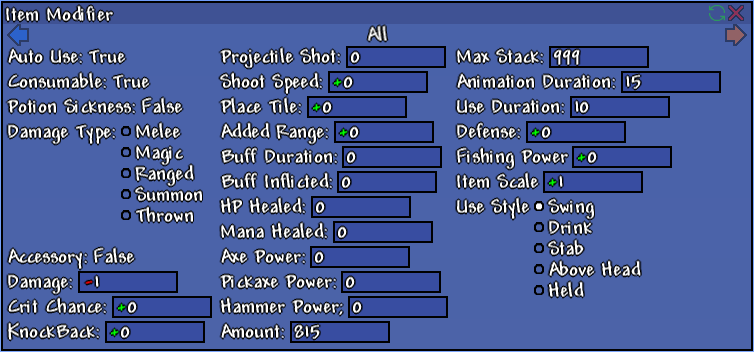{:width="500px"}

The New Item Window

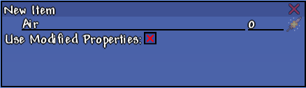

and The Changelog Window

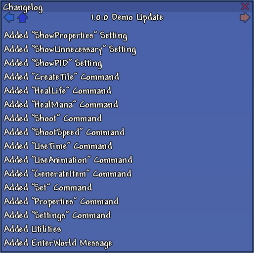

---

And 5 buttons,

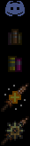

From top to bottom, 

the first button launches Discord and invites you to the [server](https://discord.gg/UjQWNC2){:target="_blank"},

the second button opens the Changelog Window,

the third button launches the [wiki page](https://kryptonion.github.io/ItemModifier/){:target="_blank"},

the fourth button opens the New Item Window,

the fifth button opens the Item Modifier Window.

---

# Item Modifier Window
This window allows the user to modify the properties of the selected item.

The {:height="12px"} button to the top-right, beside the X button, toggles Live Sync on and off. If Live Sync is on, then any modifications to the item's properties will instantly sync to the inputs. However, if no item is selected, a lock screen will appear over the window. Else if Live Sync is off, then the lock screen won't appear, but instead, the properties are displayed, but won't change even if the item is changed.

The {:height="12px"} and {:height="12px"} arrows below the title bar cycles through 6 categories.

The 6 categories are
1. All
2. Tools
3. Weapons
4. Potions
5. Armor
6. Accessories

The All Category displays all Properties.

{:width="500px"}

The Tools Category displays all Tool Properties.

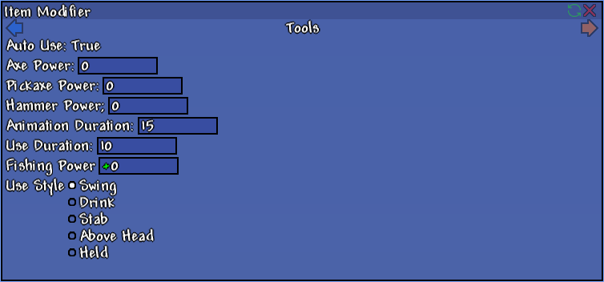{:width="500px"}

The Weapons Category displays all Weapon Properties.

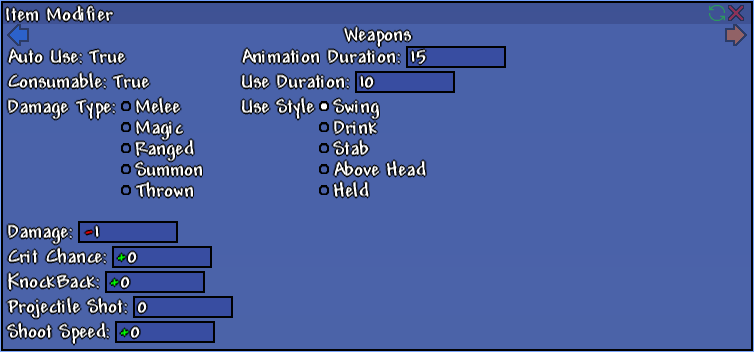{:width="500px"}

The Potions Category displays all Potion Properties.

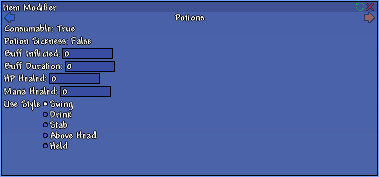{:width="500px"}

The Armor Category displays all Armor Properties.

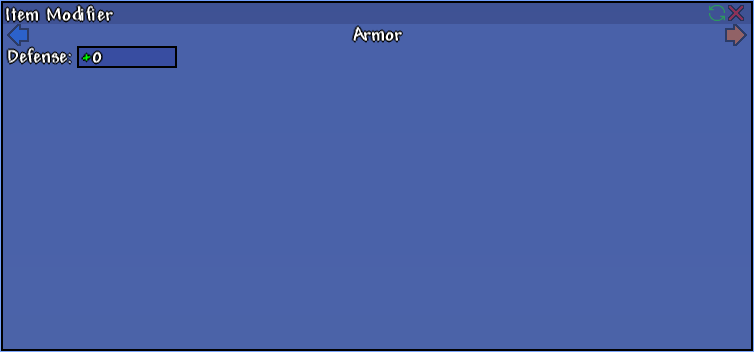{:width="500px"}

The Accessories Category displays all Accessory Properties.

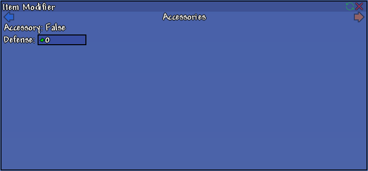{:width="500px"}

All inputs in the categories correspond to a property. The properties and their uses are listed [here](Item Properties.md).

# New Item Window
This window allows the user to create a new item.
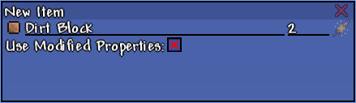

The first textbox corresponds to the item's name, and the second one corresponds to the item's id, and the 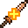{:height="12px"} button right of the two textboxes creates a new item. And finally, the checkbox below controls if the new item will have modified properties.